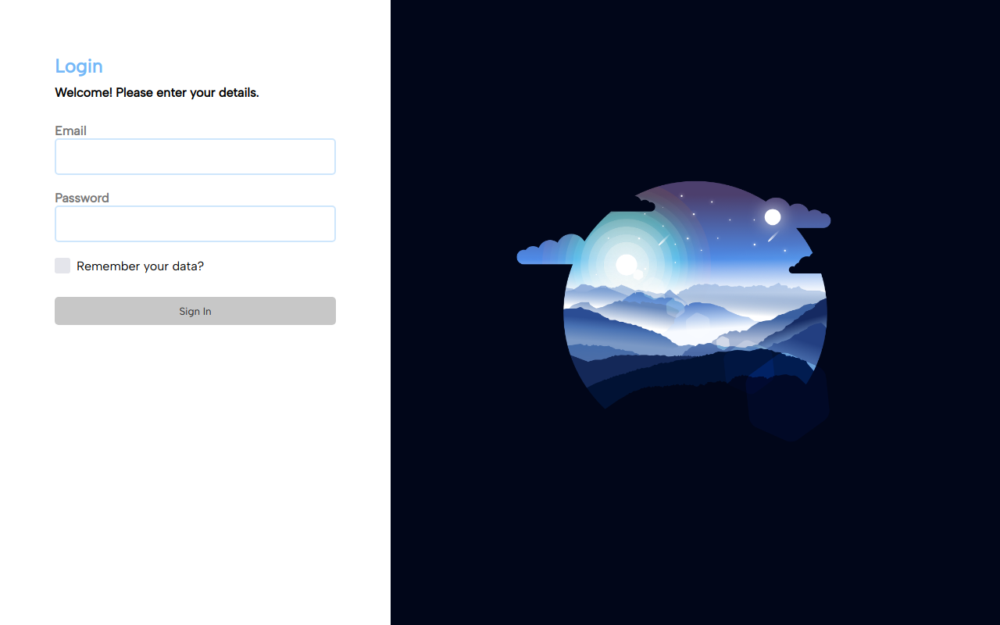

# Login Page Project

> O projeto consiste em uma aplicação que simula uma página de login utilizando HTML, CSS e JS manipulando elementos do DOM.

## 💻 Pré-requisitos

Para jogar, verifique os seguintes requisitos:

- Você ter instalado `VSCode e extensão Live Server`

Obs.: essa etapa é necessária para que o background da página renderize corretamente!

⚠️ Obs.: Caso não tenha as ferramentas acima, você pode acessar a aplicação <a href="https://login-page-project.vercel.app/" >aqui</a>

## ☕ Usando Login Page Project

Uma vez com a aplicação iniciada em seu navegador, basta preencher os dados!

## 📫 Contribuindo para o Login Page Project!

1. Clone este repositório.
2. Crie uma branch: `git checkout -b nome-da-branch`.
3. Faça suas alterações e confirme-as: `git commit -m 'mensagem-de-commit'`
4. Envie para o branch original: `git push origin nome-do-projeto / local`
5. Crie a solicitação de pull request.

Como alternativa, consulte a documentação do GitHub em [como criar uma solicitação pull](https://help.github.com/en/github/collaborating-with-issues-and-pull-requests/creating-a-pull-request).

## Inspiração para realizar os projetos

Essa página foi realizada utilizando como inspiração o seguinte modelo:

1. [Dribble Example](https://dribbble.com/shots/17564792-Log-in-page-Untitled-UI)

Além dos conhecimentos aprendidos com o vídeo disponibilizado por:

2. [Manual do Dev](https://www.youtube.com/watch?v=tyVvNj-UvxM)

[⬆ Voltar ao topo](#login-page-project) 
